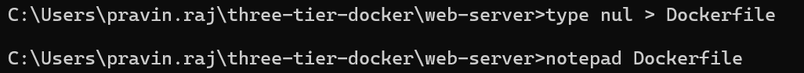

# Docker Three Tier Implementation

### 

1. **Directory Creation**
2. **Downloading the images**
3. **Docker File Setup & Impelmentation**
4. **Docker Compose File Setup & Implementation**


## Directory Creation
To work with Docker Compose (which will be covered later), we first need to create directories to maintain a structured workflow. Since we are implementing a three-tier architecture, our directory structure will be organized accordingly.

#### **Directory Structure**
>three-tier-docker/  
│-- mysql/            # Directory for MySQL database setup  
│-- python-app/       # Directory for the Flask application  
│-- web-server/       # Directory for the Apache web server  
│-- docker-compose.yml  # Docker Compose file to define and manage services  


```Note : Run docker engine  after creating the directories```

Directory final flow will be:

>Few file and folders will be added later

```
three-tier-docker:
│   docker-compose.yml
│
├───mysql
│       db_init.sql
│       Dockerfile
│
├───python-app
│   │   app.py
│   │   Dockerfile
│   │
│   └───compose
│           app.py
│           Dockerfile
│
└───web-server
    │   Dockerfile
    │   httpd.conf
    │   index.html
    │
    └───compose
            Dockerfile
            httpd.conf
            index.html
```

## Downloading Images 
Docker images can be downloaded directly from Docker Hub using the docker pull command. This method ensures you get the required version of images quickly and efficiently.

For our setup, we will use the following images:

1. Apache2 as the web server
2. Python for the backend server
3. MySQL 8.0 as the database server

>A Docker image is a lightweight, standalone, and executable package that contains everything needed to run an application, including the code, runtime, dependencies, and system libraries. It serves as a template to create Docker containers.
```sh 
Commands:

docker pull python:latest
docker pull httpd:latest
docker pull mysql:8.0
docker images
```

## Docker File Setup

A Dockerfile is a script containing a set of instructions to automate the creation of a Docker image. It defines the base image, dependencies, configurations, and commands needed to set up an application inside a container.

Before creating a Dockerfile, we need to identify the required files, dependencies, and configurations necessary for our setup. These elements must be properly placed inside the Dockerfile to ensure the container functions correctly.

#### 1. Mysql (DB server) - Docker file setup

Required file : db_init.sql

Since we use MySql for DB, the configuration will be :

1. Defining our base image as MySql version 8.0
2. Setting MySql environment with the credentials
3. Copy our db_init.sql file create the db

> Create docker file inside the mysql folder and open it in notepad: 
>
> ``` type nul > Dockerfile```
>
> ``` notepad Dockerfile```

Copy these instructions and save it
```
FROM mysql:8

ENV MYSQL_ROOT_PASSWORD=rootpassword
ENV MYSQL_DATABASE=user_data
ENV MYSQL_USER=admin
ENV MYSQL_PASSWORD=admin123

COPY db_init.sql /docker-entrypoint-initdb.d/
```


Next we run this image in a container.

> Docker container creation  code : ``` docker run -d --name mysql-server-container mysql-server```


Thorugh the image above we can verify that mysql-server-container is started and mysql server runs in the port 3306 (default port of myql)


#### 2. App-Server - Docker file setup

Required file : app.py

We use python and flask api for our application server. To achieve this, we will:

1. Defining our base  image as Python
2. Set a working directory and copy our application python code.
3. Install flask and mysql connector and expose the port 5000
4. Then fixing an task to run the python with python file (app.py) when ever the image is running in a container 

> Create docker file inside the python-app folderand open it in notepad: 
>
> ``` type nul > Dockerfile```
>
> ``` notepad Dockerfile```

Copy these instructions and save it

```
FROM python:latest

WORKDIR /app

COPY app.py .

RUN pip install flask mysql-connector-python

EXPOSE 5000

CMD ["python", "app.py"]

```


Next we run this image in a container.

> Docker container creation  code : ``` docker run -d --name web-server-container web-server```


Thorugh the image above we can verify that python-app-container is started and flask app runs in the port 5000.

Now we will check whether the python application flask is able to make communication with mysql server.To do that we need to build a network between python-app-container and mysql-server-container.


>Commands :
>
> ``` docker network create py-mysql ```
>
> ``` docker network connect py-mysql python-app-container ```
>
> ``` docker network connect py-mysql mysql-server-container ```


Next, we will enter the container and send a request to MySQL using the Flask application.

>Commands : 
>
> ``` docker exec -it python-app-container bash ```
>
> ```hostname -I```
>
> ```curl http://172.17.0.2:5000/api/get_users```
>
> ```curl -X POST http://172.17.0.2:5000/api/add_user -H "Content-Type: application/json" -d '{"name": "docker", "age": "12", "email": "Some@email"}'```


Flask app is running perfectly and could able to communicate with mysql.


#### 3. Web-Server - Docker file setup
Required file : index.html and httpd.conf

Since we are using Apache2, we need to set up a reverse proxy (this configuration will available in httpd.conf) to connect the Python application server. To achieve this, we will:
1. Defining our base  image as httpd(apache2)
1. Copy the httpd.conf file (Apache configuration) into the container.
2. Copy our website's HTML files into the Apache default document root folder.
4. Exposing the port 8080

> **EXPOSE 8080** : It informs users and other developers which ports the container will use and also helps when running multiple containers in a Docker network, as some tools (like Docker Compose) can read EXPOSE to auto-map ports.

> Create docker file inside the web-server folder and open it in notepad: 
>
> ``` type nul > Dockerfile```
>
> ``` notepad Dockerfile```



Copy these instructions and save it

```
FROM httpd:latest

COPY index.html /usr/local/apache2/htdocs/

COPY httpd.conf /usr/local/apache2/conf/

EXPOSE 8080 
```
Now, now build image and run it in a container and check whether everything is working perfectly.

> Docker build code : ``` docker build -t web-server . ```


Run the builded image : web-server in a container 

> Docker run code : ``` docker run -d -p 8080:8080 --name web-server-container web-server ```


> Here, we expose the Docker container's port 8080 to the host machine's port 8080. This allows us to access the website on the host machine using ```http://localhost:8080/```. 

Next we need to create a network between web-server container and python-app-container to enable the communication between them.


Now check the website in your host-machine browser using ```http://localhost:8080/```

#### Result

List of our images, container running & network


## Docker Compose

Docker Compose is a powerful tool that allows us to define and manage multi-container applications using a simple YAML configuration file (docker-compose.yml). Instead of manually running multiple docker run and docker network commands, Docker Compose automates the entire process with a single command. Additionally, it helps with version control, ensuring consistency across different environments.

Previously, we were manually building and running containers using docker run commands. With Docker Compose, we define these containers as services inside a docker-compose.yml file. A service is essentially a container configuration that specifies:

1. The image to use
2. Ports for communication
3. Environment variables
4. Dependencies between containers
5. Networking and storage settings

Instead of managing containers individually, Docker Compose allows us to define everything in one place. This makes it easier to start, stop, and scale the entire setup efficiently with a single command.

Now, we will set up the Docker Compose file to automate our containerized environment.

>Since, we done created dockerfile before itself we changed few thing in httpd.conf and app.py. So, for compose we created compose folder in every server directory and pasted those file ,it can be referred from the git.

> Create docker compose file : ``` notepad docker-compose.yml ```


```
version: '1.0'

services:
  mysql:
    #Specifying the path of docker file
    build: ./image/mysql 

    container_name: compose-mysql-server-container

    #attaching network to the container
    networks:
      - backend

    #Additionally we add voulme to our DB
    volumes:
      - mysql_data:/var/lib/mysql

    #Commands the service to restart whenever docker engine is running
    restart: always

  app:
    build: ./image/python-app/compose 
    container_name: compose-app-server-container 

    #We define service depends on the mysql service. So, Whenever we run docker-compose up, Docker Compose will start mysql before starting this service
    depends_on:
      - mysql
   
    networks:
      - backend
      - frontend

    restart: always

  web:
    build: ./image/web-server/compose  

    container_name: compose-web-server-container

    depends_on:
      - app

    networks:
      - frontend
    #Routing the request from container port 8080 to 9090 host machine because web-server-container is using that port
    port:
      - "9090:8080"

    restart: always

#defining the networks
networks:
  backend:
    driver: bridge
  frontend:
    driver: bridge

#defining the volumn
volumes:
  mysql_data:


```
Before building the docker compose we need make change the proxy address in httpd.conf in web-server
```
ProxyPass "/api/" "http://compose-app-server-container:5000/api/"

ProxyPassReverse "/api/" "http://compose-app-server-container:5000/api/"
```

Change the mysql hostname to compose-web-server-container in the python code of python-app.

> Docker compose run : ```docker-compose up -d --build```


Now, our website is launched and it can seen in our host machine using ```http://localhost:9090/```

#### Result


Here, we can see all the running container, networks and images


<h1 style="text-align: center;">நன்றி வணக்கம் 🙏</h1>
